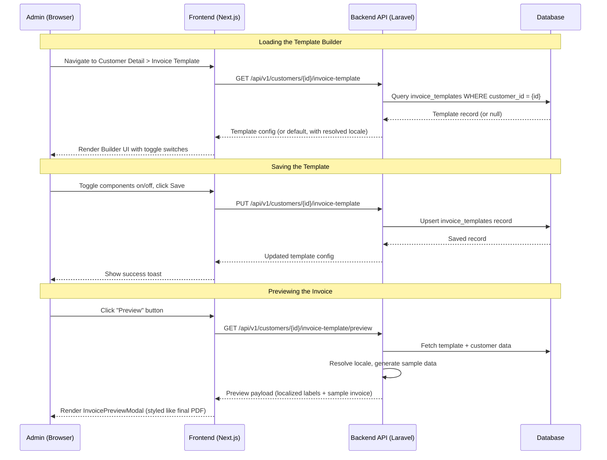

# Technical Design: Invoice Form Builder

## 1. Architectural Overview

The Invoice Form Builder adds **per-customer invoice template customization** to the accounting system. It introduces a configuration layer between the `Customer` and `Invoice` modules, allowing admins to toggle invoice components on/off for each customer, with automatic language localization driven by the customer's currency.

### High-Level Integration

- **Backend**: New `InvoiceTemplate` model + `InvoiceTemplateController` + `InvoiceTemplateService`. A `config/invoice.php` file defines the default component registry, currency-locale mappings, and localized label dictionaries (English and Japanese).
- **Frontend**: New `InvoiceTemplateBuilder` component on the customer detail page (`/customers/[id]`) with toggle switches. An `InvoicePreviewModal` renders a styled preview matching the Timedoor Invoice format.

### Key Design Decisions

1. **JSON-based template storage**: The template configuration (enabled/disabled per component) is stored as a JSON column on a new `invoice_templates` table. No reordering — components always render in the fixed default order.
2. **Server-side locale resolution**: The backend resolves labels + currency formatting based on the customer's `currency` field. JPY → Japanese labels with `¥` and period-separated formatting; USD/IDR → English labels.
3. **Default template fallback**: If no custom template exists, the system uses the hardcoded default with all components enabled (Req 1, AC-1).
4. **Two mandatory components**: `company_header` and `line_items` cannot be disabled (Req 3, AC-3).

---

## 2. Data Flow Diagram



---

## 3. Component & Interface Definitions

### 3.1 Backend

#### New Model: `InvoiceTemplate`

```php
// app/Models/InvoiceTemplate.php
class InvoiceTemplate extends Model
{
    protected $fillable = ['customer_id', 'components'];

    protected $casts = ['components' => 'array'];

    public function customer(): BelongsTo
    {
        return $this->belongsTo(Customer::class);
    }
}
```

#### Default Template & Locale Config

```php
// config/invoice.php
return [
    'default_components' => [
        ['key' => 'company_header',    'label' => 'Company Header',               'enabled' => true, 'required' => true],
        ['key' => 'invoice_meta',      'label' => 'Invoice Meta',                 'enabled' => true, 'required' => false],
        ['key' => 'customer_details',  'label' => 'Customer Details',             'enabled' => true, 'required' => false],
        ['key' => 'sender_details',    'label' => 'Sender Details',               'enabled' => true, 'required' => false],
        ['key' => 'total_summary_box', 'label' => 'Total Summary Box',            'enabled' => true, 'required' => false],
        ['key' => 'line_items',        'label' => 'Line Items Table',             'enabled' => true, 'required' => true],
        ['key' => 'grand_total',       'label' => 'Grand Total',                  'enabled' => true, 'required' => false],
        ['key' => 'bank_transfer',     'label' => 'Bank Transfer Information',    'enabled' => true, 'required' => false],
        ['key' => 'transfer_fee_note', 'label' => 'Transfer Fee Note',            'enabled' => true, 'required' => false],
    ],

    'currency_locale_map' => [
        'IDR' => ['language' => 'en', 'locale' => 'id-ID'],
        'USD' => ['language' => 'en', 'locale' => 'en-US'],
        'JPY' => ['language' => 'ja', 'locale' => 'ja-JP'],
        'AUD' => ['language' => 'en', 'locale' => 'en-AU'],
        'SGD' => ['language' => 'en', 'locale' => 'en-SG'],
    ],

    'labels' => [
        'en' => [
            'invoice'          => 'INVOICE',
            'invoice_date'     => 'Invoice Date',
            'invoice_number'   => 'Invoice Number',
            'to'               => 'To:',
            'item'             => 'Item',
            'amount'           => 'Amount',
            'total'            => 'Total',
            'grand_total'      => 'Grand Total (Tax Incl.)',
            'bank_info'        => 'Bank Transfer Information',
            'bank_name'        => 'Bank Name',
            'swift_code'       => 'SWIFT Code',
            'account_name'     => 'Account Name',
            'account_number'   => 'Account Number',
            'transfer_fee'     => 'Transfer fee is the responsibility of the sender.',
        ],
        'ja' => [
            'invoice'          => 'INVOICE',
            'invoice_date'     => '請求日',
            'invoice_number'   => '請求番号',
            'to'               => '御中',
            'item'             => '項目',
            'amount'           => '料金日本円',
            'total'            => '合計',
            'grand_total'      => '合計金額(税込)',
            'bank_info'        => 'お振込先',
            'bank_name'        => '銀行名',
            'swift_code'       => 'SWIFTコード',
            'account_name'     => '口座名義',
            'account_number'   => '口座番号',
            'transfer_fee'     => 'お振込手数料は御社負担にてお願い致します',
        ],
    ],
];
```

#### New Service: `InvoiceTemplateService`

```php
// app/Services/InvoiceTemplateService.php
class InvoiceTemplateService
{
    /** Get template for customer, or default if none exists */
    public function getTemplateForCustomer(Customer $customer): array;

    /** Upsert the template components config */
    public function saveTemplate(Customer $customer, array $components): InvoiceTemplate;

    /** Get preview data with localized labels + sample invoice */
    public function getPreviewData(Customer $customer): array;

    /** Resolve locale info from customer's currency */
    public function resolveLocale(string $currency): array;
    // Returns: ['language' => 'ja', 'locale' => 'ja-JP', 'labels' => [...]]

    /** Get the default components list from config */
    public function getDefaultComponents(): array;
}
```

#### New Controller: `InvoiceTemplateController`

```php
// app/Http/Controllers/InvoiceTemplateController.php
class InvoiceTemplateController extends Controller
{
    /** GET /customers/{customer}/invoice-template */
    public function show(Customer $customer): JsonResponse;

    /** PUT /customers/{customer}/invoice-template */
    public function update(UpdateInvoiceTemplateRequest $request, Customer $customer): JsonResponse;

    /** GET /customers/{customer}/invoice-template/preview */
    public function preview(Customer $customer): JsonResponse;
}
```

#### Customer Model Extension

```php
// Added relationship to app/Models/Customer.php
public function invoiceTemplate(): HasOne
{
    return $this->hasOne(InvoiceTemplate::class);
}
```

### 3.2 Frontend

#### TypeScript Types

```typescript
// types/invoice-template.ts

export type InvoiceComponentKey =
    | 'company_header'
    | 'invoice_meta'
    | 'customer_details'
    | 'sender_details'
    | 'total_summary_box'
    | 'line_items'
    | 'grand_total'
    | 'bank_transfer'
    | 'transfer_fee_note';

export interface InvoiceComponentConfig {
    key: InvoiceComponentKey;
    label: string;
    enabled: boolean;
    required: boolean;
}

export interface InvoiceTemplate {
    id: number | null;
    customer_id: number;
    components: InvoiceComponentConfig[];
    resolved_locale: ResolvedLocale;
    created_at: string | null;
    updated_at: string | null;
}

export interface ResolvedLocale {
    language: string;
    locale: string;
    labels: Record<string, string>;
}

export interface InvoiceTemplateFormData {
    components: Array<{ key: InvoiceComponentKey; enabled: boolean }>;
}

export interface InvoicePreviewData {
    template: InvoiceTemplate;
    locale: ResolvedLocale;
    sample_invoice: {
        invoice_number: string;
        invoice_date: string;
        customer_name: string;
        company_name: string;
        sender: {
            company_name: string;
            address: string;
            phone: string;
            email: string;
        };
        items: Array<{
            description: string;
            amount: number;
        }>;
        total: number;
        currency: string;
        bank_info: {
            bank_name: string;
            swift_code: string;
            account_name: string;
            account_number: string;
        };
    };
}
```

#### New React Components

| Component | Location | Purpose |
|-----------|----------|---------|
| `InvoiceTemplateBuilder` | `components/invoices/InvoiceTemplateBuilder.tsx` | Main builder form with toggle switches per component, Save and Preview buttons |
| `InvoicePreviewModal` | `components/invoices/InvoicePreviewModal.tsx` | Dialog rendering the localized invoice preview, styled to match the Timedoor Invoice PDF format |

#### New API Client & Hook

```typescript
// lib/api/invoice-templates.ts
export function getInvoiceTemplate(customerId: number): Promise<{ data: InvoiceTemplate }>;
export function updateInvoiceTemplate(customerId: number, data: InvoiceTemplateFormData): Promise<{ data: InvoiceTemplate }>;
export function getInvoicePreview(customerId: number): Promise<{ data: InvoicePreviewData }>;

// lib/hooks/useInvoiceTemplates.ts
export function useInvoiceTemplate(customerId: number): UseQueryResult;
export function useUpdateInvoiceTemplate(): UseMutationResult;
export function useInvoicePreview(customerId: number, enabled: boolean): UseQueryResult;
```

#### Customer Detail Page Changes

The existing `app/customers/[id]/page.tsx` will be extended with a new **"Invoice Template"** section below the "Profile Information" section. This section embeds the `InvoiceTemplateBuilder` component.

---

## 4. API Endpoint Definitions

### 4.1 Get Invoice Template

**`GET /api/v1/customers/{customer}/invoice-template`**

Returns the customer's custom template, or the default template if none exists. Always includes the resolved locale based on the customer's currency.

**Success Response (200):**

```json
{
    "data": {
        "id": 1,
        "customer_id": 5,
        "components": [
            { "key": "company_header",    "label": "Company Header",            "enabled": true,  "required": true },
            { "key": "invoice_meta",      "label": "Invoice Meta",              "enabled": true,  "required": false },
            { "key": "customer_details",  "label": "Customer Details",          "enabled": true,  "required": false },
            { "key": "sender_details",    "label": "Sender Details",            "enabled": true,  "required": false },
            { "key": "total_summary_box", "label": "Total Summary Box",         "enabled": false, "required": false },
            { "key": "line_items",        "label": "Line Items Table",          "enabled": true,  "required": true },
            { "key": "grand_total",       "label": "Grand Total",               "enabled": true,  "required": false },
            { "key": "bank_transfer",     "label": "Bank Transfer Information", "enabled": true,  "required": false },
            { "key": "transfer_fee_note", "label": "Transfer Fee Note",         "enabled": true,  "required": false }
        ],
        "resolved_locale": {
            "language": "ja",
            "locale": "ja-JP",
            "labels": {
                "invoice": "INVOICE",
                "invoice_date": "請求日",
                "invoice_number": "請求番号",
                "to": "御中",
                "item": "項目",
                "amount": "料金日本円",
                "total": "合計",
                "grand_total": "合計金額(税込)",
                "bank_info": "お振込先",
                "transfer_fee": "お振込手数料は御社負担にてお願い致します"
            }
        },
        "created_at": "2026-02-16T06:00:00.000000Z",
        "updated_at": "2026-02-16T06:00:00.000000Z"
    }
}
```

**When no custom template exists:** Returns the default config with `"id": null`.

---

### 4.2 Save/Update Invoice Template

**`PUT /api/v1/customers/{customer}/invoice-template`**

Upserts the customer's template. Only `key` and `enabled` are required per component; `label` and `required` are resolved server-side.

**Request Body:**

```json
{
    "components": [
        { "key": "company_header",    "enabled": true },
        { "key": "invoice_meta",      "enabled": true },
        { "key": "customer_details",  "enabled": true },
        { "key": "sender_details",    "enabled": true },
        { "key": "total_summary_box", "enabled": false },
        { "key": "line_items",        "enabled": true },
        { "key": "grand_total",       "enabled": true },
        { "key": "bank_transfer",     "enabled": true },
        { "key": "transfer_fee_note", "enabled": true }
    ]
}
```

**Success Response (200):**

```json
{
    "data": { /* Full InvoiceTemplate object with resolved_locale */ },
    "message": "Invoice template saved successfully"
}
```

**Validation Error (422):**

```json
{
    "message": "Validation failed",
    "errors": {
        "components.0.key": ["The selected key is invalid."],
        "components": ["Required component 'company_header' cannot be disabled."]
    }
}
```

---

### 4.3 Preview Invoice

**`GET /api/v1/customers/{customer}/invoice-template/preview`**

Returns a fully localized invoice preview with sample data, matching the Timedoor Invoice format.

**Success Response (200):**

```json
{
    "data": {
        "template": { /* InvoiceTemplate object */ },
        "locale": {
            "language": "ja",
            "locale": "ja-JP",
            "labels": { "item": "項目", "amount": "料金日本円", "total": "合計", "grand_total": "合計金額(税込)" }
        },
        "sample_invoice": {
            "invoice_number": "INV-2026-0001",
            "invoice_date": "2026-02-16",
            "customer_name": "株式会社 ファイブ・タッグ",
            "company_name": "Five Tag Co., Ltd.",
            "sender": {
                "company_name": "PT. Timedoor Indonesia",
                "address": "Jl. Tukad Yeh Aya IX No.46 Renon, Denpasar, Bali 80226, Indonesia",
                "phone": "+62 361 4741555",
                "email": "info@timedoor.net"
            },
            "items": [
                { "description": "ウェブ開発サービス", "amount": 100000 },
                { "description": "デザインコンサルティング", "amount": 50000 }
            ],
            "total": 150000,
            "currency": "JPY",
            "bank_info": {
                "bank_name": "三菱UFJ銀行",
                "swift_code": "BOTKJPJT",
                "account_name": "PT. Timedoor Indonesia",
                "account_number": "1234567"
            }
        }
    }
}
```

---

## 5. Database Schema Changes

### New Migration: `create_invoice_templates_table`

```php
// database/migrations/YYYY_MM_DD_HHMMSS_create_invoice_templates_table.php

Schema::create('invoice_templates', function (Blueprint $table) {
    $table->id();
    $table->foreignId('customer_id')
          ->unique()
          ->constrained()
          ->cascadeOnDelete();
    $table->json('components'); // Array of {key, enabled} objects
    $table->timestamps();
});
```

**Design Notes:**
- `customer_id` is `UNIQUE` — one custom template per customer.
- `CASCADE ON DELETE` — template is cleaned up when customer is soft-deleted.
- `components` stores only `key` and `enabled`; `label` and `required` are resolved from `config/invoice.php` at read time.
- No `language_code` column — language is always auto-resolved from the customer's existing `currency` field.

---

## 6. Security Considerations

| Concern | Mitigation |
|---------|------------|
| **Component key whitelist** | `UpdateInvoiceTemplateRequest` validates each `components.*.key` against the allowed keys from `config('invoice.default_components')`. |
| **Required components** | Server-side validation rejects requests that set `enabled: false` on components marked `required: true` (`company_header`, `line_items`). Returns 422. |
| **JSON structure** | Each component item is validated to have exactly `key` (string, in whitelist) and `enabled` (boolean). |
| **Authorization** | Uses existing route group. No additional auth needed for single-tenant admin-only usage. Future: add `manage_invoices` permission when user roles are implemented. |
| **Data integrity** | `UNIQUE` constraint prevents duplicate templates. Cascade delete prevents orphans. |

---

## 7. Test Strategy

### 7.1 Unit Tests (Backend — PHPUnit)

**Run with:** `cd backend && php artisan test --filter=InvoiceTemplate`

| Test | Coverage |
|------|----------|
| `InvoiceTemplateServiceTest::test_returns_default_when_no_template_exists` | Req 1 AC-1 |
| `InvoiceTemplateServiceTest::test_resolves_jpy_to_japanese_labels` | Req 2 AC-1 |
| `InvoiceTemplateServiceTest::test_resolves_usd_to_english_labels` | Req 2 AC-3 |
| `InvoiceTemplateServiceTest::test_resolves_idr_to_english_labels` | Req 2 AC-4 |
| `InvoiceTemplateServiceTest::test_required_components_cannot_be_disabled` | Req 3 AC-3 |

### 7.2 Feature Tests (Backend — PHPUnit)

**Run with:** `cd backend && php artisan test --filter=InvoiceTemplate`

| Test | Coverage |
|------|----------|
| `GET /customers/{id}/invoice-template` returns default when no custom template | Req 1 AC-1 |
| `PUT /customers/{id}/invoice-template` creates new template | Req 1 AC-5 |
| `PUT /customers/{id}/invoice-template` updates existing template | Req 1 AC-2, AC-4 |
| `PUT` rejects disabling a required component (422) | Req 3 AC-3 |
| `PUT` rejects invalid component keys (422) | Validation |
| `GET /customers/{id}/invoice-template/preview` returns localized data for JPY customer | Req 2 AC-1, AC-2 |
| `GET preview` for USD customer returns English labels | Req 2 AC-3 |
| Deleting a customer cascades to delete the template | Data integrity |

### 7.3 Manual Verification (Frontend)

1. **Open a customer detail page** → Verify "Invoice Template" section appears with toggle switches for all 9 components.
2. **Toggle off "Bank Transfer Information"** → Save → Refresh → Verify it remains off.
3. **Attempt toggling off "Company Header" or "Line Items Table"** → Verify the toggles are disabled/locked.
4. **Click "Preview"** on a **JPY customer** → Verify Japanese labels (`項目`, `料金日本円`, `合計`, `合計金額(税込)`, `お振込先`) and `¥` currency with period separator (`¥150.000`).
5. **Click "Preview"** on a **USD customer** → Verify English labels and `$1,500.00` formatting.
6. **Click "Preview"** on an **IDR customer** → Verify English labels and `Rp 1.500.000` formatting.
7. **Preview with a disabled component** → Verify it does not appear in the preview.
