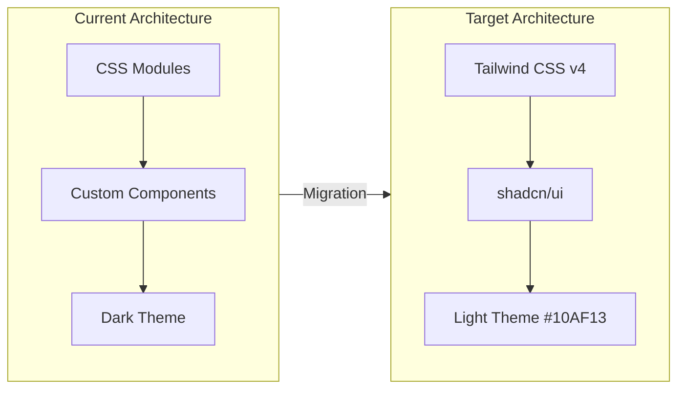
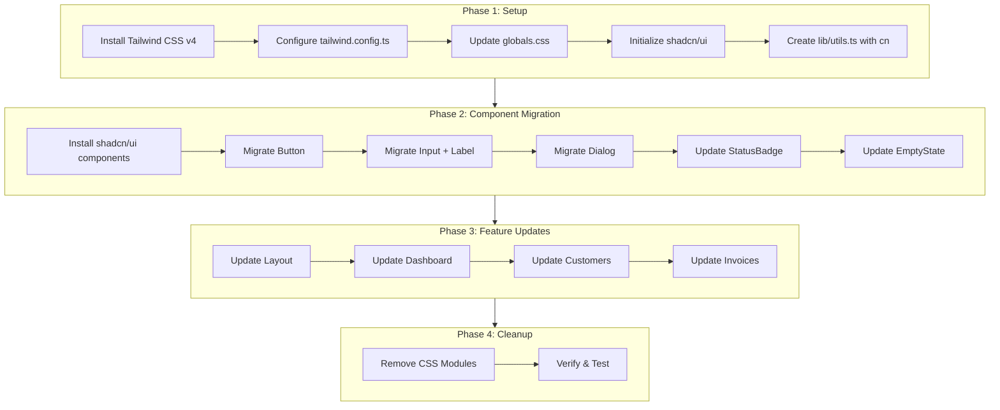

# Technical Design: UI Migration to Tailwind CSS + shadcn/ui

## Architectural Overview

This design outlines the migration from **CSS Modules** (vanilla CSS) to **Tailwind CSS v4** with **shadcn/ui** components. The migration also transitions the visual theme from a dark mode with purple/indigo branding to a **light theme** with **green (#10AF13)** as the primary brand color.

### Current State
- **Styling**: CSS Modules (`.module.css` files)
- **Components**: Custom implementations (Button, Input, Modal, EmptyState, StatusBadge)
- **Theme**: Dark mode with purple (#6366f1) brand color
- **Dependencies**: Next.js 16.x, React 19.x, TanStack Query 5.x

### Target State
- **Styling**: Tailwind CSS v4 utility classes
- **Components**: shadcn/ui foundation with custom extensions
- **Theme**: Light mode with green (#10AF13) brand color
- **New Dependencies**: Tailwind CSS v4, shadcn/ui, Lucide React, class-variance-authority, clsx, tailwind-merge



---

## Data Flow Diagram



---

## Component & Interface Definitions

### Utility Function: `cn()`

#### [NEW] [utils.ts](file:///Users/kevin/Documents/Projects/internal/accounting_timedoor/frontend/lib/utils.ts)

```typescript
import { type ClassValue, clsx } from "clsx"
import { twMerge } from "tailwind-merge"

export function cn(...inputs: ClassValue[]) {
  return twMerge(clsx(inputs))
}
```

---

### Button Component

#### [REPLACE] [button.tsx](file:///Users/kevin/Documents/Projects/internal/accounting_timedoor/frontend/components/ui/button.tsx)

Replaces current `Button.tsx` with shadcn/ui Button using class-variance-authority.

```typescript
import * as React from "react"
import { Slot } from "@radix-ui/react-slot"
import { cva, type VariantProps } from "class-variance-authority"
import { cn } from "@/lib/utils"
import { Loader2 } from "lucide-react"

const buttonVariants = cva(
  "inline-flex items-center justify-center gap-2 whitespace-nowrap rounded-md text-sm font-medium transition-colors focus-visible:outline-none focus-visible:ring-2 focus-visible:ring-ring disabled:pointer-events-none disabled:opacity-50",
  {
    variants: {
      variant: {
        default: "bg-primary text-primary-foreground hover:bg-primary/90",
        destructive: "bg-destructive text-destructive-foreground hover:bg-destructive/90",
        outline: "border border-input bg-background hover:bg-accent hover:text-accent-foreground",
        secondary: "bg-secondary text-secondary-foreground hover:bg-secondary/80",
        ghost: "hover:bg-accent hover:text-accent-foreground",
        link: "text-primary underline-offset-4 hover:underline",
      },
      size: {
        default: "h-10 px-4 py-2",
        sm: "h-9 rounded-md px-3",
        lg: "h-11 rounded-md px-8",
        icon: "h-10 w-10",
      },
    },
    defaultVariants: {
      variant: "default",
      size: "default",
    },
  }
)

export interface ButtonProps
  extends React.ButtonHTMLAttributes<HTMLButtonElement>,
    VariantProps<typeof buttonVariants> {
  asChild?: boolean
  loading?: boolean
}

const Button = React.forwardRef<HTMLButtonElement, ButtonProps>(
  ({ className, variant, size, asChild = false, loading = false, disabled, children, ...props }, ref) => {
    const Comp = asChild ? Slot : "button"
    return (
      <Comp
        className={cn(buttonVariants({ variant, size, className }))}
        ref={ref}
        disabled={disabled || loading}
        {...props}
      >
        {loading && <Loader2 className="h-4 w-4 animate-spin" />}
        {children}
      </Comp>
    )
  }
)
Button.displayName = "Button"

export { Button, buttonVariants }
```

---

### Input Component

#### [REPLACE] [input.tsx](file:///Users/kevin/Documents/Projects/internal/accounting_timedoor/frontend/components/ui/input.tsx)

```typescript
import * as React from "react"
import { cn } from "@/lib/utils"
import { Label } from "@/components/ui/label"

export interface InputProps extends React.InputHTMLAttributes<HTMLInputElement> {
  label?: string
  error?: string
  hint?: string
}

const Input = React.forwardRef<HTMLInputElement, InputProps>(
  ({ className, type, label, error, hint, id, ...props }, ref) => {
    const inputId = id || label?.toLowerCase().replace(/\s/g, "-")
    
    return (
      <div className="space-y-2">
        {label && (
          <Label htmlFor={inputId} className="text-sm font-medium text-foreground">
            {label}
            {props.required && <span className="text-destructive ml-1">*</span>}
          </Label>
        )}
        <input
          type={type}
          id={inputId}
          className={cn(
            "flex h-10 w-full rounded-md border border-input bg-background px-3 py-2 text-sm ring-offset-background file:border-0 file:bg-transparent file:text-sm file:font-medium placeholder:text-muted-foreground focus-visible:outline-none focus-visible:ring-2 focus-visible:ring-ring disabled:cursor-not-allowed disabled:opacity-50",
            error && "border-destructive focus-visible:ring-destructive",
            className
          )}
          ref={ref}
          {...props}
        />
        {hint && !error && (
          <p className="text-sm text-muted-foreground">{hint}</p>
        )}
        {error && (
          <p className="text-sm text-destructive">{error}</p>
        )}
      </div>
    )
  }
)
Input.displayName = "Input"

export { Input }
```

---

### Label Component

#### [NEW] [label.tsx](file:///Users/kevin/Documents/Projects/internal/accounting_timedoor/frontend/components/ui/label.tsx)

```typescript
import * as React from "react"
import * as LabelPrimitive from "@radix-ui/react-label"
import { cva, type VariantProps } from "class-variance-authority"
import { cn } from "@/lib/utils"

const labelVariants = cva(
  "text-sm font-medium leading-none peer-disabled:cursor-not-allowed peer-disabled:opacity-70"
)

const Label = React.forwardRef<
  React.ElementRef<typeof LabelPrimitive.Root>,
  React.ComponentPropsWithoutRef<typeof LabelPrimitive.Root> &
    VariantProps<typeof labelVariants>
>(({ className, ...props }, ref) => (
  <LabelPrimitive.Root
    ref={ref}
    className={cn(labelVariants(), className)}
    {...props}
  />
))
Label.displayName = LabelPrimitive.Root.displayName

export { Label }
```

---

### Dialog Component (Replaces Modal)

#### [REPLACE] [dialog.tsx](file:///Users/kevin/Documents/Projects/internal/accounting_timedoor/frontend/components/ui/dialog.tsx)

Uses shadcn/ui Dialog based on Radix UI primitives. Full implementation from shadcn/ui with custom styling.

```typescript
"use client"

import * as React from "react"
import * as DialogPrimitive from "@radix-ui/react-dialog"
import { X } from "lucide-react"
import { cn } from "@/lib/utils"

const Dialog = DialogPrimitive.Root
const DialogTrigger = DialogPrimitive.Trigger
const DialogPortal = DialogPrimitive.Portal
const DialogClose = DialogPrimitive.Close

const DialogOverlay = React.forwardRef<
  React.ElementRef<typeof DialogPrimitive.Overlay>,
  React.ComponentPropsWithoutRef<typeof DialogPrimitive.Overlay>
>(({ className, ...props }, ref) => (
  <DialogPrimitive.Overlay
    ref={ref}
    className={cn(
      "fixed inset-0 z-50 bg-black/80 data-[state=open]:animate-in data-[state=closed]:animate-out data-[state=closed]:fade-out-0 data-[state=open]:fade-in-0",
      className
    )}
    {...props}
  />
))
DialogOverlay.displayName = DialogPrimitive.Overlay.displayName

const DialogContent = React.forwardRef<
  React.ElementRef<typeof DialogPrimitive.Content>,
  React.ComponentPropsWithoutRef<typeof DialogPrimitive.Content>
>(({ className, children, ...props }, ref) => (
  <DialogPortal>
    <DialogOverlay />
    <DialogPrimitive.Content
      ref={ref}
      className={cn(
        "fixed left-[50%] top-[50%] z-50 grid w-full max-w-lg translate-x-[-50%] translate-y-[-50%] gap-4 border bg-background p-6 shadow-lg duration-200 data-[state=open]:animate-in data-[state=closed]:animate-out data-[state=closed]:fade-out-0 data-[state=open]:fade-in-0 data-[state=closed]:zoom-out-95 data-[state=open]:zoom-in-95 data-[state=closed]:slide-out-to-left-1/2 data-[state=closed]:slide-out-to-top-[48%] data-[state=open]:slide-in-from-left-1/2 data-[state=open]:slide-in-from-top-[48%] sm:rounded-lg",
        className
      )}
      {...props}
    >
      {children}
      <DialogPrimitive.Close className="absolute right-4 top-4 rounded-sm opacity-70 ring-offset-background transition-opacity hover:opacity-100 focus:outline-none focus:ring-2 focus:ring-ring focus:ring-offset-2 disabled:pointer-events-none data-[state=open]:bg-accent data-[state=open]:text-muted-foreground">
        <X className="h-4 w-4" />
        <span className="sr-only">Close</span>
      </DialogPrimitive.Close>
    </DialogPrimitive.Content>
  </DialogPortal>
))
DialogContent.displayName = DialogPrimitive.Content.displayName

const DialogHeader = ({ className, ...props }: React.HTMLAttributes<HTMLDivElement>) => (
  <div className={cn("flex flex-col space-y-1.5 text-center sm:text-left", className)} {...props} />
)
DialogHeader.displayName = "DialogHeader"

const DialogFooter = ({ className, ...props }: React.HTMLAttributes<HTMLDivElement>) => (
  <div className={cn("flex flex-col-reverse sm:flex-row sm:justify-end sm:space-x-2", className)} {...props} />
)
DialogFooter.displayName = "DialogFooter"

const DialogTitle = React.forwardRef<
  React.ElementRef<typeof DialogPrimitive.Title>,
  React.ComponentPropsWithoutRef<typeof DialogPrimitive.Title>
>(({ className, ...props }, ref) => (
  <DialogPrimitive.Title
    ref={ref}
    className={cn("text-lg font-semibold leading-none tracking-tight", className)}
    {...props}
  />
))
DialogTitle.displayName = DialogPrimitive.Title.displayName

const DialogDescription = React.forwardRef<
  React.ElementRef<typeof DialogPrimitive.Description>,
  React.ComponentPropsWithoutRef<typeof DialogPrimitive.Description>
>(({ className, ...props }, ref) => (
  <DialogPrimitive.Description
    ref={ref}
    className={cn("text-sm text-muted-foreground", className)}
    {...props}
  />
))
DialogDescription.displayName = DialogPrimitive.Description.displayName

export {
  Dialog,
  DialogPortal,
  DialogOverlay,
  DialogClose,
  DialogTrigger,
  DialogContent,
  DialogHeader,
  DialogFooter,
  DialogTitle,
  DialogDescription,
}
```

---

### ConfirmDialog Component

#### [NEW] [confirm-dialog.tsx](file:///Users/kevin/Documents/Projects/internal/accounting_timedoor/frontend/components/ui/confirm-dialog.tsx)

Replaces `ConfirmModal` using AlertDialog from shadcn/ui.

```typescript
"use client"

import {
  AlertDialog,
  AlertDialogAction,
  AlertDialogCancel,
  AlertDialogContent,
  AlertDialogDescription,
  AlertDialogFooter,
  AlertDialogHeader,
  AlertDialogTitle,
} from "@/components/ui/alert-dialog"
import { buttonVariants } from "@/components/ui/button"
import { cn } from "@/lib/utils"
import { Loader2 } from "lucide-react"

interface ConfirmDialogProps {
  open: boolean
  onOpenChange: (open: boolean) => void
  onConfirm: () => void
  title: string
  description: string
  confirmText?: string
  cancelText?: string
  variant?: "default" | "destructive"
  loading?: boolean
}

export function ConfirmDialog({
  open,
  onOpenChange,
  onConfirm,
  title,
  description,
  confirmText = "Confirm",
  cancelText = "Cancel",
  variant = "destructive",
  loading = false,
}: ConfirmDialogProps) {
  return (
    <AlertDialog open={open} onOpenChange={onOpenChange}>
      <AlertDialogContent>
        <AlertDialogHeader>
          <AlertDialogTitle>{title}</AlertDialogTitle>
          <AlertDialogDescription>{description}</AlertDialogDescription>
        </AlertDialogHeader>
        <AlertDialogFooter>
          <AlertDialogCancel disabled={loading}>{cancelText}</AlertDialogCancel>
          <AlertDialogAction
            onClick={onConfirm}
            disabled={loading}
            className={cn(buttonVariants({ variant }))}
          >
            {loading && <Loader2 className="mr-2 h-4 w-4 animate-spin" />}
            {confirmText}
          </AlertDialogAction>
        </AlertDialogFooter>
      </AlertDialogContent>
    </AlertDialog>
  )
}
```

---

### StatusBadge Component

#### [MODIFY] [status-badge.tsx](file:///Users/kevin/Documents/Projects/internal/accounting_timedoor/frontend/components/ui/status-badge.tsx)

```typescript
import { cn } from "@/lib/utils"
import { InvoiceStatus } from "@/types/invoice"

interface StatusBadgeProps {
  status: InvoiceStatus
  className?: string
}

const statusConfig: Record<InvoiceStatus, { label: string; className: string }> = {
  draft: {
    label: "Draft",
    className: "bg-zinc-100 text-zinc-600",
  },
  sent: {
    label: "Sent",
    className: "bg-blue-100 text-blue-600",
  },
  paid: {
    label: "Paid",
    className: "bg-emerald-100 text-emerald-600",
  },
  overdue: {
    label: "Overdue",
    className: "bg-red-100 text-red-600",
  },
  cancelled: {
    label: "Cancelled",
    className: "bg-gray-100 text-gray-600",
  },
}

export function StatusBadge({ status, className }: StatusBadgeProps) {
  const config = statusConfig[status]

  return (
    <span
      className={cn(
        "inline-flex items-center rounded-full px-2.5 py-0.5 text-xs font-medium",
        config.className,
        className
      )}
    >
      {config.label}
    </span>
  )
}
```

---

### EmptyState Component

#### [MODIFY] [empty-state.tsx](file:///Users/kevin/Documents/Projects/internal/accounting_timedoor/frontend/components/ui/empty-state.tsx)

```typescript
import { cn } from "@/lib/utils"
import { Button } from "@/components/ui/button"
import { LucideIcon } from "lucide-react"

interface EmptyStateProps {
  icon: LucideIcon
  title: string
  description: string
  action?: {
    label: string
    onClick: () => void
  }
  className?: string
}

export function EmptyState({
  icon: Icon,
  title,
  description,
  action,
  className,
}: EmptyStateProps) {
  return (
    <div className={cn("flex flex-col items-center justify-center py-12 text-center", className)}>
      <div className="rounded-full bg-muted p-4 mb-4">
        <Icon className="h-8 w-8 text-muted-foreground" />
      </div>
      <h3 className="text-lg font-semibold text-foreground mb-2">{title}</h3>
      <p className="text-sm text-muted-foreground max-w-sm mb-6">{description}</p>
      {action && (
        <Button onClick={action.onClick}>
          {action.label}
        </Button>
      )}
    </div>
  )
}
```

---

## CSS Variable Definitions

#### [MODIFY] [globals.css](file:///Users/kevin/Documents/Projects/internal/accounting_timedoor/frontend/app/globals.css)

```css
@import "tailwindcss";

@layer base {
  :root {
    --background: 0 0% 100%;
    --foreground: 0 0% 4%;
    
    --card: 0 0% 100%;
    --card-foreground: 0 0% 4%;
    
    --popover: 0 0% 100%;
    --popover-foreground: 0 0% 4%;
    
    --primary: 120 83% 37%;
    --primary-foreground: 0 0% 100%;
    
    --secondary: 240 5% 96%;
    --secondary-foreground: 0 0% 9%;
    
    --muted: 240 5% 96%;
    --muted-foreground: 240 4% 46%;
    
    --accent: 120 83% 31%;
    --accent-foreground: 0 0% 100%;
    
    --destructive: 0 84% 60%;
    --destructive-foreground: 0 0% 100%;
    
    --border: 240 6% 90%;
    --input: 240 6% 90%;
    --ring: 120 83% 37%;
    
    --radius: 0.5rem;
  }
}

@layer base {
  * {
    @apply border-border;
  }
  
  body {
    @apply bg-background text-foreground antialiased;
    font-family: 'Inter', -apple-system, BlinkMacSystemFont, 'Segoe UI', Roboto, sans-serif;
  }
}
```

---

## Tailwind Configuration

#### [NEW] [tailwind.config.ts](file:///Users/kevin/Documents/Projects/internal/accounting_timedoor/frontend/tailwind.config.ts)

```typescript
import type { Config } from "tailwindcss"

const config = {
  darkMode: ["class"],
  content: [
    "./pages/**/*.{ts,tsx}",
    "./components/**/*.{ts,tsx}",
    "./app/**/*.{ts,tsx}",
    "./src/**/*.{ts,tsx}",
  ],
  prefix: "",
  theme: {
    container: {
      center: true,
      padding: "2rem",
      screens: {
        "2xl": "1400px",
      },
    },
    extend: {
      colors: {
        border: "hsl(var(--border))",
        input: "hsl(var(--input))",
        ring: "hsl(var(--ring))",
        background: "hsl(var(--background))",
        foreground: "hsl(var(--foreground))",
        primary: {
          DEFAULT: "hsl(var(--primary))",
          foreground: "hsl(var(--primary-foreground))",
        },
        secondary: {
          DEFAULT: "hsl(var(--secondary))",
          foreground: "hsl(var(--secondary-foreground))",
        },
        destructive: {
          DEFAULT: "hsl(var(--destructive))",
          foreground: "hsl(var(--destructive-foreground))",
        },
        muted: {
          DEFAULT: "hsl(var(--muted))",
          foreground: "hsl(var(--muted-foreground))",
        },
        accent: {
          DEFAULT: "hsl(var(--accent))",
          foreground: "hsl(var(--accent-foreground))",
        },
        popover: {
          DEFAULT: "hsl(var(--popover))",
          foreground: "hsl(var(--popover-foreground))",
        },
        card: {
          DEFAULT: "hsl(var(--card))",
          foreground: "hsl(var(--card-foreground))",
        },
      },
      borderRadius: {
        lg: "var(--radius)",
        md: "calc(var(--radius) - 2px)",
        sm: "calc(var(--radius) - 4px)",
      },
      keyframes: {
        "accordion-down": {
          from: { height: "0" },
          to: { height: "var(--radix-accordion-content-height)" },
        },
        "accordion-up": {
          from: { height: "var(--radix-accordion-content-height)" },
          to: { height: "0" },
        },
      },
      animation: {
        "accordion-down": "accordion-down 0.2s ease-out",
        "accordion-up": "accordion-up 0.2s ease-out",
      },
    },
  },
  plugins: [require("tailwindcss-animate")],
} satisfies Config

export default config
```

---

## shadcn/ui Configuration

#### [NEW] [components.json](file:///Users/kevin/Documents/Projects/internal/accounting_timedoor/frontend/components.json)

```json
{
  "$schema": "https://ui.shadcn.com/schema.json",
  "style": "new-york",
  "rsc": true,
  "tsx": true,
  "tailwind": {
    "config": "tailwind.config.ts",
    "css": "app/globals.css",
    "baseColor": "zinc",
    "cssVariables": true,
    "prefix": ""
  },
  "aliases": {
    "components": "@/components",
    "utils": "@/lib/utils",
    "ui": "@/components/ui",
    "lib": "@/lib",
    "hooks": "@/lib/hooks"
  }
}
```

---

## Files to Create/Modify Summary

| Action | File | Description |
|--------|------|-------------|
| NEW | `lib/utils.ts` | `cn()` utility function |
| NEW | `tailwind.config.ts` | Tailwind configuration |
| NEW | `components.json` | shadcn/ui configuration |
| NEW | `components/ui/label.tsx` | Label component |
| NEW | `components/ui/confirm-dialog.tsx` | ConfirmDialog component |
| MODIFY | `app/globals.css` | Tailwind imports + CSS variables |
| REPLACE | `components/ui/button.tsx` | shadcn/ui Button |
| REPLACE | `components/ui/input.tsx` | Enhanced Input with Tailwind |
| REPLACE | `components/ui/dialog.tsx` | shadcn/ui Dialog (replaces Modal) |
| MODIFY | `components/ui/status-badge.tsx` | Tailwind classes |
| MODIFY | `components/ui/empty-state.tsx` | Tailwind classes |
| DELETE | All `.module.css` files | Remove CSS Modules after migration |

---

## Security Considerations

| Concern | Mitigation |
|---------|------------|
| **XSS via className injection** | Using `cn()` from clsx + tailwind-merge ensures only valid classes are applied |
| **Accessibility** | shadcn/ui components are built on Radix UI primitives with WCAG 2.1 AA compliance |
| **Focus management** | Dialog traps focus automatically; visible focus rings on all interactive elements |

---

## Test Strategy

### Automated Tests

No existing frontend tests found. Manual verification will be the primary testing method.

### Manual Verification

1. **Visual Regression Check**
   - Start the development server: `npm run dev`
   - Navigate to each page (Dashboard, Customers, Invoices)
   - Verify light theme with white background is applied
   - Verify green (#10AF13) is used for primary buttons and active states

2. **Component Functionality**
   - **Button**: Test all variants (default, secondary, destructive, outline, ghost)
   - **Input**: Test with label, error state, hint text, and required field indicator
   - **Dialog**: Test open/close via button, Escape key, and overlay click
   - **ConfirmDialog**: Test cancel and confirm actions with loading state

3. **Browser Compatibility**
   - Test in Chrome, Firefox, Safari, and Edge (latest 2 versions)

4. **Accessibility**
   - Test keyboard navigation (Tab, Escape)
   - Verify focus indicators are visible
   - Test with screen reader (VoiceOver on macOS)

5. **Build Verification**
   - Run `npm run build` to ensure no TypeScript or build errors
   - Verify CSS bundle is optimized (unused classes purged)

---

## Dependencies to Install

```bash
# Install Tailwind CSS v4 and dependencies
npm install tailwindcss@^4 @tailwindcss/postcss postcss

# Install shadcn/ui dependencies
npm install class-variance-authority clsx tailwind-merge
npm install @radix-ui/react-dialog @radix-ui/react-label @radix-ui/react-slot @radix-ui/react-alert-dialog
npm install lucide-react
npm install tailwindcss-animate
```
